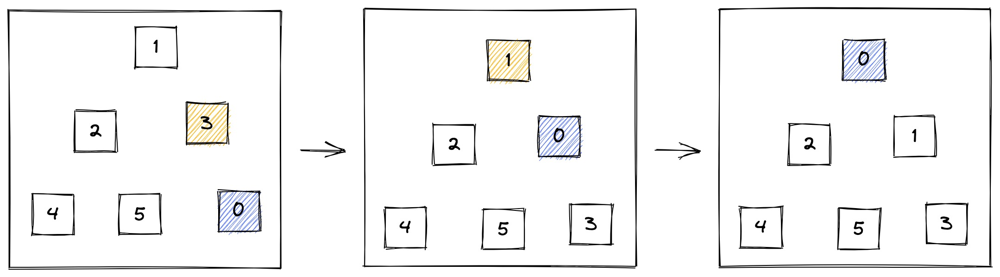
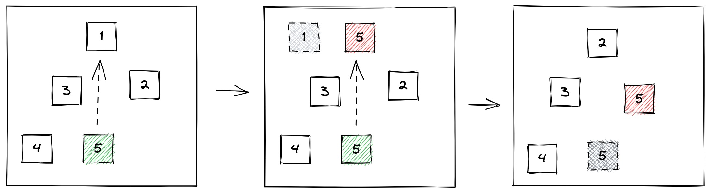

## 二叉堆

> 本质上是完全二叉树
>
> 分为两个类型: **最大堆**、**最小堆** 
> 
> **最大堆** : 任一父节点都 >= 它左右子节点的值
> 
> **最小堆** : 任一父节点都 <= 它左右子节点的值
> 
> **堆顶** : 二叉堆的根节点
> 
> 二叉堆的物理数据结构都储存在*数组*中, 顺序储存。

### 二叉堆的自我调整

> 把一个不符合堆性质的完全二叉树, 调整成符合条件的堆
> 
> 它的插入、删除、构建操作都会进行对应的调整

以一个最小堆来说,

```
             1
          2     3
        4   5  6  7
      6   8
```

#### 插入 O(logn)



往后最后一个节点插入`0`, 此时`0`比父节点`3`小,需进行「 上移 」与`3`替换了位置。

以此类推, 直至`0`成为新的根节点。

```js
const upAdjust = function(arr) {
  // 找到插入的节点位置
  let childrenIdx = arr.length - 1
  // 根据队列找父级的公式找出最后一个节点的父节点
  let parentIdx = Math.floor((childrenIdx - 1) / 2)
  // 存储此次插入的节点值, 用于最后的赋值
  let tmp = arr[childrenIdx]
  while(childrenIdx > 0 && tmp < arr[parentIdx]){
    // 子节点值换成父节点
    arr[childrenIdx] = arr[parentIdx]
    // 向上升一个层级比较
    childrenIdx = parentIdx
    parentIdx = Math.floor((parentIdx - 1) / 2)
  }
  arr[childrenIdx] = tmp
}
const tree = [1,2,3,4,5,2]
upAdjust(tree)
console.log(tree)
// ==> [0,2,1,4,5,3]
```

注意:  循环过程中并没有实际的替换两个节点的值, 只是单向的将父节点的值赋值给子节点位置，然后向上一个层级移动。

#### 删除 O(logn)

操作步骤:

1. 删除堆顶的节点
2. 将堆中最后一个节点临时移动到根节点
3. 让临时节点跟它的左右节点**最小的一个**比较, 如果大了就继续下沉

依次循环, 最终得到一个调整好的最小堆





```js
/*
* @params arr 堆
* @params parentIndex 要删除的父节点
* @params len 堆的有效大小
*/
const downAdjust = (arr, parentIndex, len) => {
  
}
```


#### 构建 O(n)

将一个无序的完全二叉树调整为二叉堆, 操作步骤:

1. 从最后一个**非叶子节点**开始, 与左右子节点的最小的一个比较,并与其互换
2. 然后往上一个**非叶子节点**继续比较、互换
