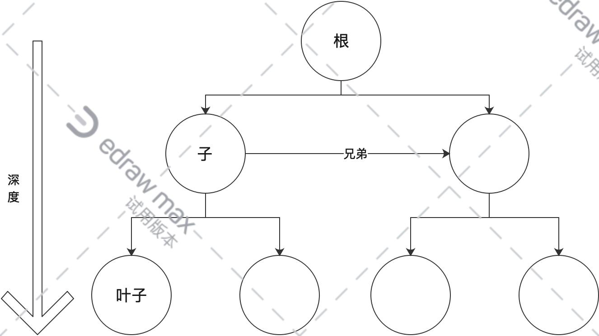
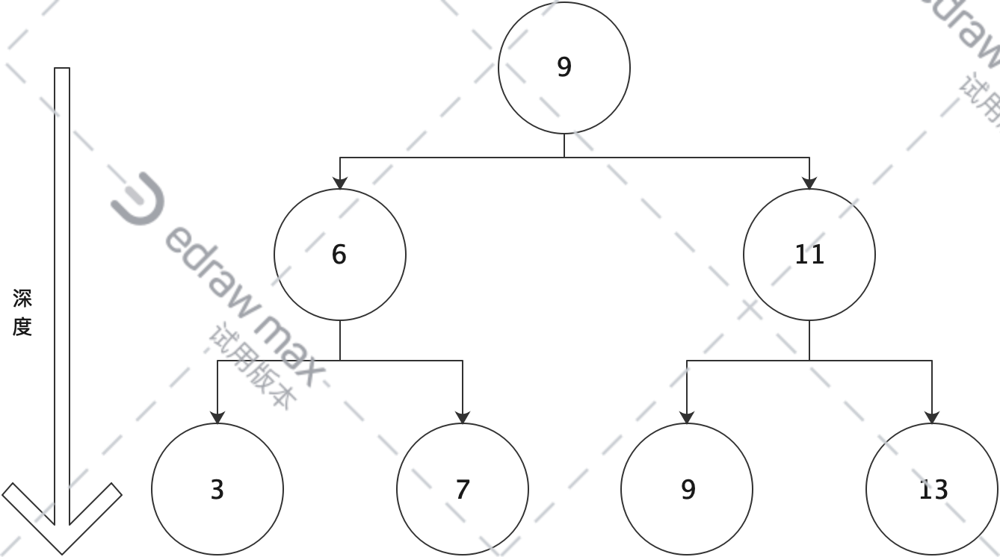
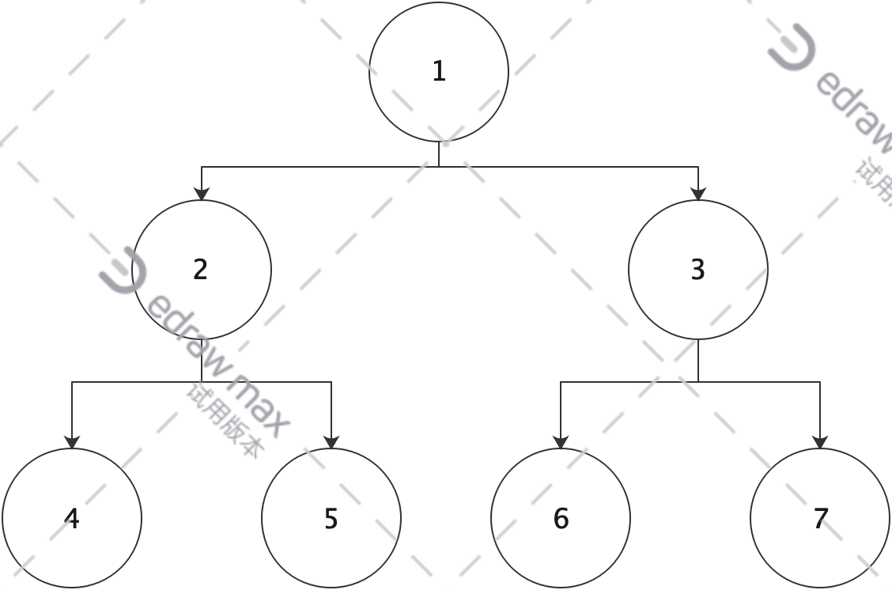

## 树

> 树是N个节点的有限集(n >= 0)。
> 
> 并且每个集合又是一个树，被称为根的**子树**。
> 
> 没有下一个子节点的节点被称为**叶子节点(leaf)**
> 
> 由同一个父节点衍生出来的子节点互相称为**兄弟节点**
> 
> 树的最大层级被称为最大深(高)度



### 二叉树

> 逻辑结构、非线性数据结构,可以被数组或链表进行表达。
> 
> 每个节点最多有两个子节点的树，左边的叫左孩子(left child), 相反则为right child。

#### 满二叉树

一个二叉树的所有节点都有左右节点，并且层级也一致。
也就是这颗二叉树，每个节点都满了。


#### 完全二叉树

将一个树按从1~n开始给每个节点标上序号，如果这颗树的节点顺序与同样深度的满二叉树节点位置相同，则称为完全二叉树。


可以看到同样深度为3个树，跟上图满二叉树的顺序一致，那不管6、7在不在，都是完全二叉树,完全二叉树只要保证最后一个节点之前的顺序正确即可。

### 链表的二叉树定义

会有三个部分: 自身data变量、左节点指针、右节点指针。

### 数组的二叉树定义

按照二叉树的层级顺序放置到数组的节点上，如果分支的左或右节点空缺则数组对应的位置也为空。
这样就能有规律的定位各个节点的位置:
假设一个节点下标为X, 则左节点为2X+1, 右节点为2X+2。
相反的, 知道左侧子节点为Y，则父节点为(Y-1)/2。
```js
/**
             1
          2     3
        4   5  6  7
 */
const tree = [1,2,3,4,5,6,7]
// 已知父节点下标，寻找左右子节点
const parentIndex = 2
const rootL = 2 * parentIndex + 1
const rootR = 2 * parentIndex + 2

// 已知左子节点下标, 寻找父节点
const leftChild = 3
const parentIndex = (leftChild - 1) / 2

// 已知右子节点下标, 寻找父节点
const rightChild = 4
const parentIndex = (leftChild - 2) / 2

```

### 二叉树的应用

> 主要的作用是**查找操作和维持相对顺序**

#### 查找

- 二叉查找树

专门用于查找的数据结构, 定义如下:

1. 当左侧子节点不为空,则左侧树上所有深度的左侧子节点的值, 均小于根节点。
2. 当右侧子节点不为空,则右侧树上所有深度的右侧子节点的值, 均大于根节点。
3. 左、右子树也都是二叉查找树



以上图为例查找节点7, 则搜索步骤如下:

9 ( > 7 查左子节点) -> 6 ( < 7 查右子节点) -> 找到7

在分布相对均匀的二叉查找树中, 寻找一个节点的复杂度为O(logn), 与树的深度一致, 与二叉查到的算法也非常相似。

#### 维持相对顺序

同样也是用到二叉查找树, 由于其定义, 新增的节点也要遵循这个规律。

例如插入一个8, 那么 8 < 9 => 8 > 6 => 8 > 7 , 最终会插入到节点7的右侧。

所以二叉查找树还有另一个名字, **二叉排序树**

- 拓展

如果我们新增如下节点, 6,5,4,3,2,1到上面的树, 那么最终, 会变成一个“跛脚”的树


查找的效率会渐渐变成O(n), 如果要解决这个问题就涉及到**树的自平衡**

需要了解: 红黑树、AVL树、树堆...

### 二叉树的遍历

前中后序遍历都属于深度优先遍历, 层序遍历属于广度优先遍历

#### 前序遍历

> 关键词: 根、左、右



**前**: 指根节点所在的位置, 前就相当于最先返回根
**序**: 顺序, 指的是遍历之后, 返回各个节点的次序

如图, 返回的顺序为 1、2、4、5、3、6、7

- 通过[createTree.js](./createTree.js)生成如下二叉查找树

```js
// 原数组 const treeList = [10,8,12,7,9,11,14]
const binaryTree = {
    "key": 10,
    "left": {
        "key": 8,
        "left": {
            "key": 7,
            "left": null,
            "right": null
        },
        "right": {
            "key": 9,
            "left": null,
            "right": null
        }
    },
    "right": {
        "key": 12,
        "left": {
            "key": 11,
            "left": null,
            "right": null
        },
        "right": {
            "key": 14,
            "left": null,
            "right": null
        }
    }
}
```

```js
function preOrder(node) {
  if (node === null) return
  console.log(node.key)
  preOrder(node.left)
  preOrder(node.right)
}
```

#### 中序遍历
```js
function inOrder(node) {
  if (node === null) return
  inOrder(node.left)
  console.log(node.key)
  inOrder(node.right)
}
```
#### 后序遍历
```js
function postOrder(node) {
  if (node === null) return
  postOrder(node.left)
  postOrder(node.right)
  console.log(node.key)
}
```

一般用递归的方式就能够解决,

- **栈**的方式

用递归比较容易解决深度优先问题，不过也可以用栈的方式解决。
将访问过的节点入栈, 当此节点为叶子节点时, 回溯之前节点根据前中后序,访问另一个节点, 当一个节点的自身和左右节点都访问过了, 从栈中剔除。
因为栈是`FILO`, 晚访问的节点要先入栈。

```js
/**
             1
          2     3
        4   5  6  7
  栈中保存的数据如下:
  [1]
  [1,2]
  [1,2,4]
  [1,5] * 这里因为2、4都访问完了，出栈
  [3] * 5 访问完出栈, 回到根 1 出栈
  [3, 6]
  [7]
  []
*/
/*
* 前序遍历
*/
function preOrder(root) {
  if(!root) return [];//判空 如果root是空 直接返回空
  let res = [];//存放遍历后结果
  let stack = [root];//用到的栈
  let len = stack.length
    console.log(len)
  while(len){//当栈为空时 遍历完毕
    let bit = stack.pop();//出栈 这里是指针
    bit.key && res.push(bit.key)//判断树的根 入结果数组
    bit.right && stack.push(bit.right)//判断树的右子树 入栈
    bit.left && stack.push(bit.left)//判断树的左子树 入栈
    console.log(bit)
    len = stack.length
  }
  console.log('stack', stack)
  return res
}
/*
* 中序遍历
*/
function inOrder(root) {
  
}
```

#### 层序遍历

见[层序遍历](./二叉树的层序遍历.js)

